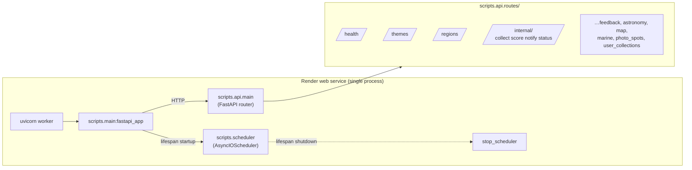
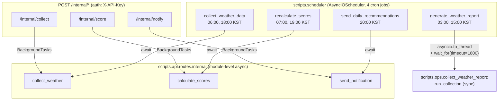
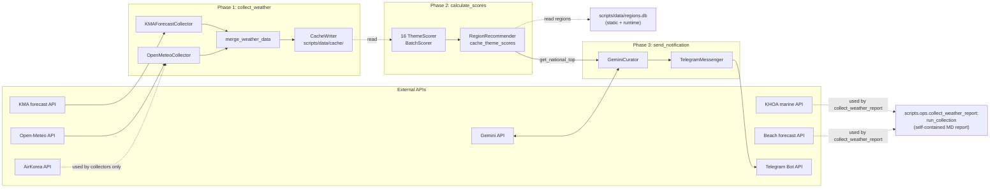
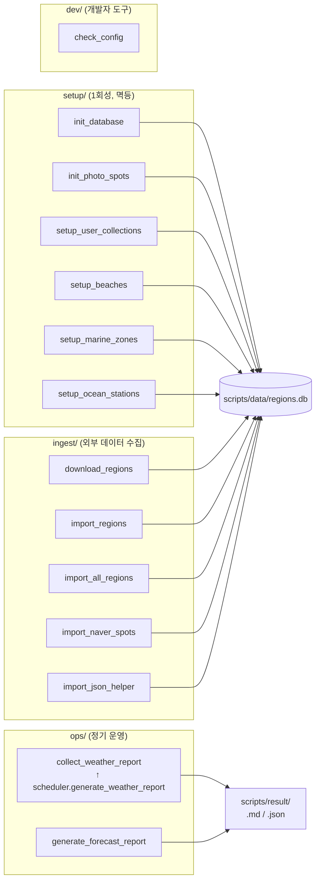

# CLAUDE.md

This file provides guidance to Claude Code (claude.ai/code) when working with code in this repository.

## Project Overview

Weather Lens — Korean photography spot recommendation backend. Pulls weather, marine,
and astronomy data from public APIs, scores each region per theme (sunrise/sunset,
Milky Way, etc.), and serves recommendations via FastAPI + Telegram. Single-process
Render deployment combining FastAPI app and APScheduler.

## Build and Development Commands

- Install: `pip install -r requirements.txt`
- Local server: `uvicorn scripts.main:fastapi_app --reload`
- Scheduler standalone: `python -m scripts.scheduler`
- One-shot weather report: `python scripts/ops/collect_weather_report.py --full`
- Lint: `ruff check scripts/`
- Tests: removed by request — none currently.

## Architecture

All Python source lives under `scripts/`. The root holds only deployment config
(`render.yaml`, `pyproject.toml`, `requirements.txt`), environment (`.env`),
documentation (`docs/`), runtime output (`result/`), and license/notes.

### Directory Tree

```
scripts/
├── main.py          # FastAPI entry (uvicorn scripts.main:fastapi_app)
├── scheduler.py     # APScheduler cron jobs (4 jobs)
├── api/             # FastAPI routes (api.routes.{health, themes, regions, ...})
├── collectors/      # External data fetchers (KMA, Open-Meteo, KHOA, AirKorea, beach)
├── config/          # settings + shared logging config
├── curators/        # Gemini text curation
├── data/            # Static reference data + runtime SQLite (regions.db, ocean_mapping.db)
├── feedbacks/       # User-feedback collection / analysis / automation
├── messengers/      # Telegram bot
├── models/          # Domain dataclasses (region, weather, ocean, feedback)
├── processors/      # Cache writer, data merger, region/beach merger, weather integrator
├── recommenders/    # Region recommender (theme-top selection)
├── scorers/         # Theme scorers + batch scorer
├── utils/           # Astronomy, ocean station mapping
├── setup/           # 1회성 부트스트랩 스크립트 (DB init, beaches/zones/stations seed)
├── ingest/          # 외부 데이터 import (regions, naver spots)
├── ops/             # 정기 운영 (collect_weather_report, generate_forecast_report)
└── dev/             # 개발자 도구 (check_config)
```

### Runtime Topology

`render.yaml`의 `uvicorn scripts.main:fastapi_app` 단일 프로세스에서 FastAPI 앱과
APScheduler가 함께 동작한다. `main.py`의 `lifespan`이 startup 시 scheduler를 켜고
shutdown 시 끈다.



### Scheduler Cron Jobs

4개 cron job은 모두 KST. 3개 job은 `scripts.api.routes.internal`의 동일한 비즈니스
함수를 직접 await; 1개 job(`generate_weather_report`)만 `scripts.ops`의 sync
함수를 `asyncio.to_thread`로 실행한다.



### Data Pipeline (collect → score → notify)

`collect_weather`는 외부 API에서 날씨를 받아 캐시에 적재. `calculate_scores`는
캐시를 읽어 16개 테마별 점수를 계산해 추천 캐시에 저장. `send_notification`은
추천 결과를 Gemini로 큐레이션 후 Telegram으로 전송.



### Lifecycle Scripts

`scripts/{setup,ingest,ops,dev}/`는 cron이 아닌 사람/scheduler가 직접 실행하는
스크립트. 각 폴더는 라이프사이클(부트스트랩/외부 데이터 수집/정기 운영/개발자 도구)을
의미.



### Cross-Cutting Notes

- **Scheduler-route 통합**: 4개 cron job 중 3개(`collect_weather_data`,
  `recalculate_scores`, `send_daily_recommendations`)는 `internal.py`의 동일
  비즈니스 함수를 직접 await, API 라우트는 그 함수를 `BackgroundTasks`로 래핑한다
  (단일 source of truth).
- **`generate_weather_report` 만 다름**: `run_collection`이 sync 대용량 IO 함수라
  `asyncio.to_thread` + `asyncio.wait_for(timeout=1800)`로 격리. 라우트 노출은
  현재 없음 (필요 시 추가 가능).
- **공용 logging**: `scripts/config/logging.py`의 `configure_logging()`이 main
  과 scheduler에서 동일 포맷을 적용.
- **`BASE_DIR`의 의미**: `scripts/config/settings.py`의 `BASE_DIR =
  Path(__file__).parent.parent`는 *프로젝트 루트가 아니라 `scripts/` 디렉터리*
  를 가리킨다. 모든 자원(`data/`, `config/weights.json`)이 함께 이동했기 때문에
  의미가 자연스럽게 정합.
- **라이프사이클 스크립트 직접 실행 호환**: 14개 스크립트가 `sys.path.insert(0,
  PROJECT_ROOT)` (3단계 위 = repo root)를 유지해 `python scripts/setup/...`
  형태 직접 실행이 동작. 표준 사용은 `python -m scripts.setup.init_database`
  도 가능.
