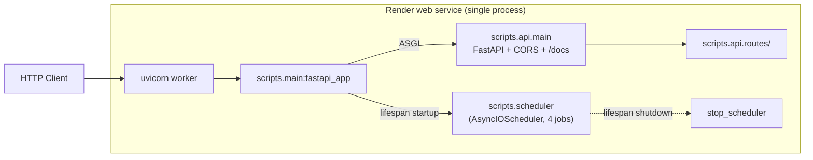
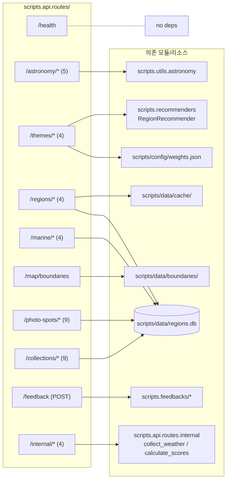
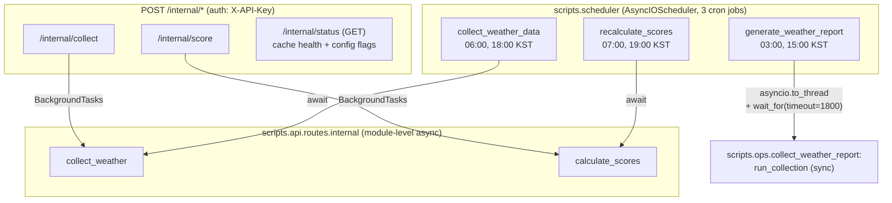
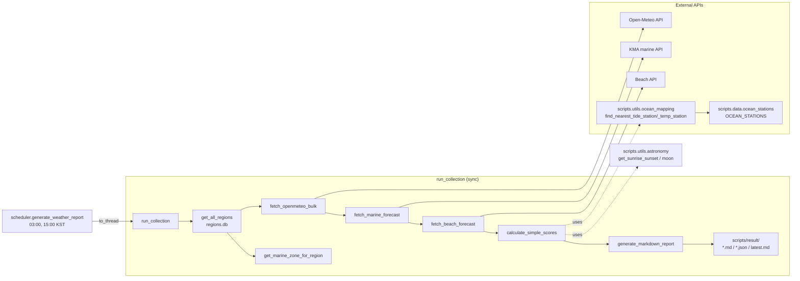
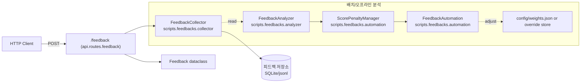
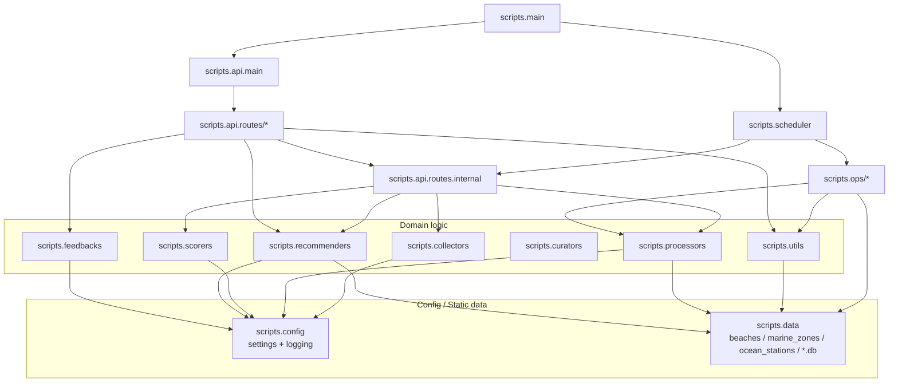
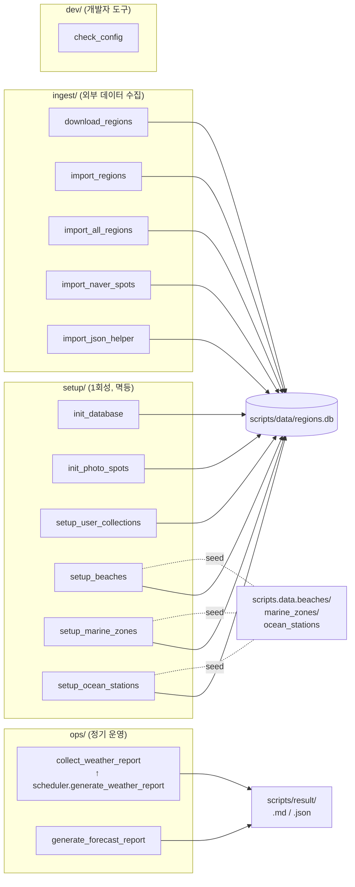

# [CLAUDE.md](http://CLAUDE.md)

This file provides guidance to Claude Code (claude.ai/code) when working with code in this repository.

## Project Overview

Weather Lens — Korean photography spot recommendation backend. Pulls weather, marine, and astronomy data from public APIs, scores each region per theme (sunrise/sunset, Milky Way, etc.), and serves recommendations via FastAPI. Single-process Render deployment combining FastAPI app and APScheduler.

## Build and Development Commands

- Install: `pip install -r requirements.txt`
- Local server: `uvicorn scripts.main:fastapi_app --reload`
- Scheduler standalone: `python -m scripts.scheduler`
- One-shot weather report: `python scripts/ops/collect_weather_report.py --full`
- Lint: `ruff check scripts/`
- Tests: removed by request — none currently.

## Architecture

All Python source lives under `scripts/`. The root holds only deployment config (`render.yaml`, `pyproject.toml`, `requirements.txt`), environment (`.env`), documentation (`docs/`), runtime output (`result/`), and license/notes.

### Directory Tree

```
scripts/
├── main.py          # FastAPI entry (uvicorn scripts.main:fastapi_app)
├── scheduler.py     # APScheduler cron jobs (4 jobs)
├── api/             # FastAPI routes (api.routes.{health, themes, regions, ...})
├── collectors/      # External data fetchers (KMA, Open-Meteo, KHOA, AirKorea, beach)
├── config/          # settings + shared logging config
├── curators/        # Gemini text curation
├── data/            # Static reference data + runtime SQLite (regions.db, ocean_mapping.db)
├── feedbacks/       # User-feedback collection / analysis / automation
├── processors/      # Cache writer, data merger, region loader
├── recommenders/    # Region recommender (theme-top selection)
├── scorers/         # Theme scorers + batch scorer
├── utils/           # Astronomy, ocean station mapping
├── setup/           # 1회성 부트스트랩 스크립트 (DB init, beaches/zones/stations seed)
├── ingest/          # 외부 데이터 import (regions, naver spots)
├── ops/             # 정기 운영 (collect_weather_report, generate_forecast_report)
└── dev/             # 개발자 도구 (check_config)
```

### 1. Runtime Topology

`render.yaml`의 `uvicorn scripts.main:fastapi_app` 단일 프로세스에서 FastAPI 앱과 APScheduler가 함께 동작한다. `main.py`의 `lifespan`이 startup 시 scheduler를 켜고 shutdown 시 끈다. CORS 미들웨어가 `*`로 열려 있고, `/docs`/`/redoc`는 자동.



### 2. API Surface Map

10개 router(11개 모듈, `/internal`은 다음 다이어그램에서 자세히)이 등록되며 각 라우트가 사용하는 의존성:



### 3. Scheduler Cron Jobs

3개 cron job은 모두 KST. 2개는 `internal.py`의 동일 비즈니스 함수를 직접 await; 1개(`generate_weather_report`)만 sync `run_collection`을 `asyncio.to_thread`로 실행.



### 4. Data Pipeline — collect → score

`internal.py`의 2단계 비즈니스 함수가 외부 API → 캐시 → 점수 → 추천으로 흘러간다. 각 단계의 처리 모듈을 모두 표시:

```mermaid
flowchart LR
    subgraph External["External APIs"]
        KMA[KMA forecast API]
        OM[Open-Meteo API]
        AirK[AirKorea API]
    end

    subgraph CollectPhase["Phase 1: collect_weather"]
        BC[BaseCollector ABC] -.subclassed by.- KCol
        KCol[KMAForecastCollector]
        OCol[OpenMeteoCollector]
        RL[RegionLoader<br/>scripts.processors]
        DM[merge_weather_data<br/>scripts.processors.data_merger]
        CW["CacheWriter<br/>scripts.processors.cache_writer"]
        BCP[BatchCacheProcessor<br/>scripts.processors.batch_cache]

        KMA --> KCol --> DM
        OM --> OCol --> DM
        AirK -.- ACol
        RL --> CollectLoop[per-region loop]
        DM --> CW
        CW <-. used by .- BCP
    end

    subgraph ScorePhase["Phase 2: calculate_scores"]
        Base[BaseScorer ABC]
        Themes["16 ThemeScorer<br/>(Sunrise/Sunset/MilkyWay/<br/>SeaLongExposure E/W/S/<br/>SeaOfClouds/StarTrail/<br/>NightCity/Fog/Reflection/<br/>Golden/Blue/Frost/Moonrise/<br/>Bioluminescence)"]
        Batch["batch_calculate_scores<br/>batch_calculate_daily_scores<br/>scripts.scorers.batch_scorer"]
        Recommender["RegionRecommender<br/>scripts.recommenders<br/>cache_theme_scores → CACHE_DIR"]
        Base -.subclassed.- Themes
        Themes --> Batch
        CW -. read cache .-> Batch
        Batch --> Recommender
        WJ2[scripts/config/weights.json] -.weights.- Themes
    end

    SQLite[(scripts/data/regions.db)]
    Recommender -. read regions .-> SQLite
    RL -. read regions .-> SQLite
```

### 5. ops.collect_weather_report (independent MD report)

`scheduler.generate_weather_report`가 호출하는 별도 sync 파이프라인. `internal.py`와 무관하게 자체적으로 외부 API를 호출하고 한 번에 MD/JSON 리포트를 생성한다.



### 6. Feedback Subsystem

사용자 피드백 수집/분석/자동화 — 별도 mini-pipeline. `/feedback` POST 라우트가 진입점이고, 백그라운드/배치 자동화는 `FeedbackAutomation`이 담당.



> **참고**: `feedbacks/automation.py`는 자동 호출 cron이 현재 등록되어 있지 않다. 수동/외부 트리거 또는 향후 cron 추가가 필요하다.

### 7. Module Dependency Overview

패키지 간 import 화살표 요약. 위쪽이 상위 계층(라우트/스케줄러), 아래쪽이 하위 인프라.



### 8. Lifecycle Scripts

`scripts/{setup,ingest,ops,dev}/`는 cron이 아닌 사람/scheduler가 직접 실행하는 스크립트.



### Cross-Cutting Notes

- **Scheduler-route 통합**: 3개 cron job 중 2개(`collect_weather_data`, `recalculate_scores`)는 `internal.py`의 동일 비즈니스 함수를 직접 await, API 라우트는 그 함수를 `BackgroundTasks`로 래핑한다 (단일 source of truth).
- `generate_weather_report` **만 다름**: `run_collection`이 sync 대용량 IO 함수라 `asyncio.to_thread` + `asyncio.wait_for(timeout=1800)`로 격리. 내부에서 자체적으로 외부 API를 호출(Diagram 5).
- **공용 logging**: `scripts/config/logging.py`의 `configure_logging()`이 main과 scheduler에서 동일 포맷을 적용.
- `BASE_DIR`**의 의미**: `scripts/config/settings.py`의 `BASE_DIR = Path(__file__).parent.parent`는 *프로젝트 루트가 아니라* `scripts/` *디렉터리*를 가리킨다. 모든 자원(`data/`, `config/weights.json`)이 함께 이동했기 때문에 의미가 자연스럽게 정합.
- **라이프사이클 스크립트 직접 실행 호환**: 14개 스크립트가 `sys.path.insert(0, PROJECT_ROOT)` (3단계 위 = repo root)를 유지해 `python scripts/setup/...` 형태 직접 실행이 동작. 표준 사용은 `python -m scripts.setup.init_database`도 가능.
- `AirKoreaCollector`**,** `FeedbackAutomation/ScorePenaltyManager`**,** `models/{region,weather,ocean,feedback}.py`**,** `processors/{weather_integrator, region_beach_merger}.py` 모두 호출 사이트 0건 확인 후 2026-05-01에 제거됨 (`docs/plans/2026-05-01_204620_dead-code-cleanup-and-consolidation.md`).
- `processors/__init__.py`**는 외부 public 항목만 노출**: `CacheWriter`, `merge_weather_data`, `RegionLoader`. 그 외 helper(`WeatherData`, `WeatherValue`, `weather_data_to_dict`, `write_*_cache`, `batch_cache_*`, `initialize_regions_db`, `load_all_regions`, `load_region`)는 모듈 내부 정의로만 남고 `__all__`에서 빠짐.
- **CORS**: `api/main.py`에서 `allow_origins=["*"]`로 열려 있음 — 프로덕션에선 좁힐 것을 코멘트에 명시.
- **인증 게이트**: `/internal/*`는 `verify_internal_key`(헤더 `X-API-Key` 검증, 401 또는 403)로 보호. scheduler는 직접 import이므로 인증 우회 — 같은 비즈니스 함수가 두 진입 경로를 가짐을 인지할 것.